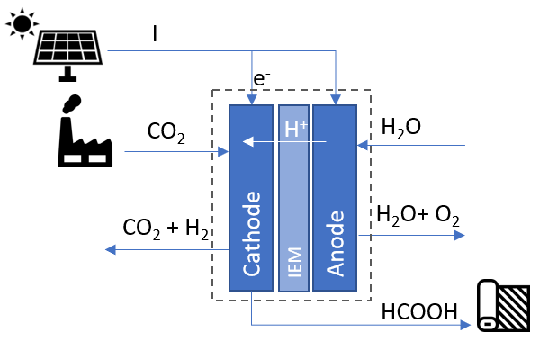

# VALCO2T Digital Twin

## Table of contents
1. General Info
2. Getting Started
3. Authors
4. Acknowlegments

## 1. General Info

This tool is a digital twin (DT) that replicates the behavior of a carbon dioxide (CO2) recycling plant prototype. The proposed system is based on an electroreduction plant. This plant is designed to recover residual CO2 generated in textile manufacturing processes, transforming it into formic acid (HCOOH) using an electrochemical reactor. To achieve this conversion, water and an electric current must be applied. Hydrogen and unreacted CO2 are obtained as waste products from the process.
The resulting formic acid is subsequently used in the textile production processes in the same factory. This strategy not only prevents GHG emissions into the atmosphere, but also reduces production costs by mitigating the need to purchase formic acid from external suppliers.




The DT is implemented as a set of software modules, each of them modeling the behavior of one or more output variables of the physical plant. This modular approach facilitates the
validation and potential replacement of specific component models without disrupting the overall system. Furthermore, it enables the selection of the most suitable model (algorithmic or AI/ML based) for each component’s behavior.

Because of the complexity of the process, there is not an algorithmic approach able to replicate the underlying physical behavior under real contiditions. Consecuently, the DT leverages AI/ML techniques. Specifically, the DT utilizes Neural Networks trained with the data collected from the physical system, in order to mimic the real operation of the electroreduction plant. This data-driven approach allows the DT to accurately mimic the operational non-linearities, providing a robust virtual representation of the system.


## 2. Getting Started

### Dependencies
It has been tested in Ubuntu 22.04.1 LTS (jammy). It has the following dependencies:

*   python3 and pip3
*   Keras 3.11.3
*   Tensorflow 2.19.1
*   mysql-connector-python 9.5

For user interface:
*   grafana-server 11.2.0

### Executing program

Import/execute file [**valco2tDT_db.sql**](src/valco2tDT_db.sql) in the mysql database.

The user interface (UI) is managed through a dedicated Grafana dashboard. Import the dashborad file [**VALCO2T_DT _Management.json**](src/VALCO2T_DT_Management.json), located in the source folder, into the Grafana Server. Once imported, this interface  enables the operator to configure and execute new experiments within the DT environment.

Execution configuration parameters of the DT can be checked in the [**config.json**](docs/config.md) file located in the config folder. It allows:
* Configure data base access parameters.
* Selection of the AI/ML models to replicate the behavior of each variable.
* Configure the number of iterations ans time between them. 

Once the execution parameters are configured, the digital twin service can be run:
```
python3 valco2tDT.py
```
Now, the digital twin service keeps waiting for a new experiment to be defined in the valco2tDT_db data base.
If grafana UI has been installed, this can be done in the VALCO2T_DT _Management dashboard by selecting a base experiment and configuring the following parameters: intensity, CO2 concentration and CO2 values.
Otherwise, the new experiment can be defined directly by inserting a new row in the [**experimentosDT**](docs/dbTables.md)table in the data base.
Once a new row is inserted in [**experimentosDT**](docs/dbTables.md) table of the data base, the digital twin starts generating the output variables estimations, storing the results in [**ejecucionesDT**](docs/dbTables.md) table. If grafana UI is used, the results will be automatically displayed in the dashboard.


## 3. Authors

Laura Rodríguez de Lope - laura.rdelope@unican.es

Luis Diez - luisfrancisco.diez@unican.es

Ramón Agüero - ramon.agueroc@unican.es


## 4. Acknolegments

This work has been funded by the Spanish Government (Ministry of Science, Innovation and Universities) and the European Union (Next GenerationEU/RTRP) through the project “Validation of a prototype of CO2-Recycling Plant in hard to abate sectors: textile industry (VALCO2-T)” (PLEC2022-009398), as well as by the Government of Cantabria through the project “Enabling Technologies for Digital Twins and their application in the chemical and communications sectors” (GDQuiC) of the TCNIC program (2023/TCN/002).
